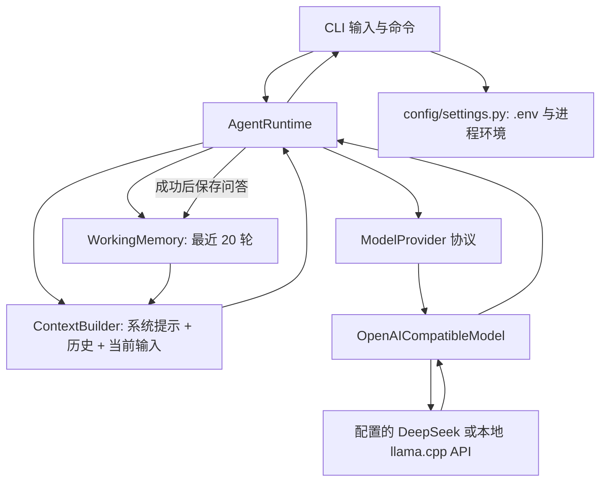
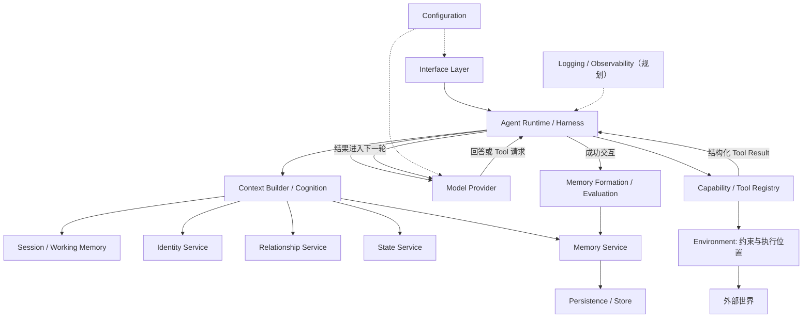

# Persistent Agent 架构

## 1. 文档状态

**状态：** Draft；**更新：** 2026-09-18；**项目阶段：** v0.1 本地对话模型试运行进行中，v0.1.1 已接入并完成本机验证，提交推送状态见工作日志与 Git。本文同时描述当前架构（Current）、目标架构（Target）与远期方向（Future）；实际行为以代码和可重复验证结果为准。

## 2. 项目目标

长期目标是可持续运行的 Agent Runtime：模型可替换，长期 Memory 独立于模型，Tool 与执行 Environment 分离，Identity、Relationship、State 各有职责；为 Web、桌面、语音、2D 角色以及视觉行动或具身交互留下接入点。**当前仍是同步、纯文本的最小 CLI Agent。**

## 3. 核心设计原则

1. Runtime 编排交互，不包揽存储、推理和工具实现。
2. Model Provider 是可替换的认知服务；外部服务经 Provider 或 Adapter 接入。
3. 长期 Memory 独立于供应商；Working Memory 与跨重启的 Memory 分开。
4. Tool 定义能做什么，Environment 定义在哪里做及允许做什么。
5. Context Builder 汇合本轮信息，不是数据库。
6. Identity、Relationship、State 和 Memory 分别管理稳定身份、当前关系、当前模拟状态和长期记录。
7. 模块通过项目内数据结构与协议交互；具体产品依赖留在适配层。
8. 增加高级能力时扩展或替换子系统，不让 Runtime 直接绑定数据库、厂商 SDK 或具体工具。

## 4. 当前已实现架构（Current）

`interfaces/cli.py` 从当前工作目录加载 `.env`，创建模型适配器、Working Memory、Context Builder 和 Runtime。`AgentRuntime.handle_message` 读取历史副本、构建消息、同步调用模型，成功后才保存本轮问答。`/reset` 清空会话，`/exit` 退出并关闭模型客户端。

本地入口 `scripts/local_model.py chat` 只为 CLI 子进程覆盖三个模型配置项，调用同一接口链路。`serve` 运行独立的便携 llama.cpp 服务，监听本机地址、启用本地密钥，推理程序和权重位于忽略的 `data/local-model/`。部署属于启动工具，不创建新的 Runtime 或 ModelProvider；同协议服务通过配置切换。详见[本地模型说明](./local-model.md)。



消息处理顺序：CLI 接收输入；Runtime 获取 `WorkingMemory.snapshot()`；Context Builder 形成 `Message` 列表；Model Provider 请求模型；成功回复后 `add_turn` 保存用户消息和回复；CLI 显示回复。失败的模型请求不写入历史。`/reset` 调用 `reset_session()`，`/exit` 结束循环。实际代码没有长期 Memory 或工具调用。

## 5. 目标架构（Target）

下图是边界与数据流设计，**不是现有调用链**。Model 的工具请求应由 Runtime 解释与执行；工具结果再进入下一轮模型调用。交互成功后才考虑记忆形成。



## 6. 模块职责

路径均相对 `src/persistent_agent/`。存在的空文件和目录只代表预留位置。

| 模块 | 当前职责 | 当前状态 | 未来扩展 |
| --- | --- | --- | --- |
| `core` | `Message` 数据结构；`protocols.py` 为空 | 部分实现 | 跨模块稳定协议 |
| `config` | 读取、检查三个模型配置项 | 已实现 | 数据与服务配置 |
| `runtime` | 单轮同步编排、会话清空 | 基础实现 | 工具循环与多服务编排 |
| `session` | 进程内最近 20 轮问答 | 已实现 | 任务及临时工具结果 |
| `cognition` | 系统提示、历史、输入拼接 | 基础实现 | 预算、摘要、规划 |
| `model` | Provider 协议、OpenAI 兼容适配器、错误归一 | 已实现 | 多模型与结构化工具请求 |
| `memory` | 文件与子目录占位 | 未实现 | 长期保存、检索、形成；见[专项设计](./memory-system-design.md) |
| `capabilities` | Tool 文件占位 | 未实现 | Tool 与注册表 |
| `environment` | 环境文件占位 | 未实现 | 受控工作区、远程执行 |
| `interfaces` | CLI 启动、输入与命令 | 已实现 | Web、语音等入口 |
| `identity` | Service 文件占位 | 未实现 | 稳定角色身份 |
| `relationship` | Service 文件占位 | 未实现 | 当前关系状态 |
| `state` | Service 文件占位 | 未实现 | 当前模拟状态 |

## 7. 模块边界

**Runtime：** 可以编排交互、调用服务接口、处理未来的模型请求与工具循环、判断何时结束；不直接执行 SQL、读取 Memory 数据库、依赖 DeepSeek 专有对象、实现具体 Tool，或成为所有状态的全局容器。

**Context Builder：** 目标输入为 System Rules + Identity + Current State + Relationship State + Relevant Memory + Current Session + Current Task + Tool Results。它只选择和组合本轮信息，不永久存储；当前仅使用系统提示、会话历史和当前输入。

**Model Provider：** 接收内部 `Message`，转换供应商请求并把回复转换为内部结果，统一模型错误；不访问数据库或执行环境。当前 `generate` 只返回文本，未来工具请求需要扩展协议。

**Tool 与 Environment：** 文件读取是一种 Tool；本地工作区、路径限制和授权是 Environment 的职责。当前两者均未实现。

**Session 与 Memory：** Session/Working Memory 保存当前会话最近消息，未来可含当前任务与临时 Tool Result，随进程或会话结束可消失；Persistent Memory 保存跨重启的事实、经历和长期信息，当前未实现。

## 8. 核心数据结构和协议

| 当前对象 | 实际契约 |
| --- | --- |
| `core.types.Message` | 不可变数据类；`role` 为 system/user/assistant，`content` 为字符串 |
| `model.base.ModelProvider` | `generate(Sequence[Message]) -> str` 协议 |
| `model.base.ModelError` | 模型调用的项目级异常 |
| `session.WorkingMemory` | `snapshot` 返回副本；`add_turn` 成对追加并裁剪；`clear` 清空 |
| `runtime.AgentRuntime` | `handle_message` 与 `reset_session`；依赖 Provider、WorkingMemory、ContextBuilder |

目标接口：`MemoryService` 对 Runtime 提供长期记忆操作；`MemoryStore` 隔离持久化；`MemoryRetriever` 选候选；`MemoryExtractor` 产候选；`EmbeddingProvider` 提供向量；`Tool` 定义能力；`ToolRegistry` 负责发现与分发；`Environment` 约束执行。**这些接口目前均未投入运行。**

## 9. 依赖规则

```text
interfaces → runtime → 项目内协议与服务
services → 抽象 store / provider
adapters → 外部 SDK 与具体持久化产品
```

核心层不绑定 DeepSeek、SQLite、Qdrant。Runtime 应通过接口使用 Model 与未来 Memory；上层不能绕过 Service 直读 Store。具体适配器可以依赖外部库。避免把 Runtime、Prompt、SQL 和模型调用合并成一个巨大 `memory.py`。

## 10. 数据与配置

`.env` 保存本地密钥且不提交；`.env.example` 只含变量名和无敏感示例。`data/` 约定放运行数据，`workspace/` 约定为 Agent 工作目录，均不提交；**目录约定并非安全隔离**。当前 CLI 从 `Path.cwd() / ".env"` 读取配置，进程环境变量优先，因此启动目录会影响配置定位。持久化接入时还需确定迁移、备份与数据版本策略。

## 11. 错误处理原则

当前配置缺失给出明确错误，不应输出 API Key；模型适配器将常见认证、限流、超时、连接、HTTP 及无有效文本结果转为 `ModelError`；失败轮次不保存。目标 Tool 失败返回结构化 Tool Result，由 Runtime 决定后续处理；存储或状态不一致不得静默忽略。

## 12. 扩展点

| 新能力 | 接入位置 |
| --- | --- |
| 更换模型 | 同协议服务复用现有适配器与配置；不同协议才新增 Model Provider |
| 长期记忆 | Memory Service |
| 新工具 / MCP | Capability、Tool Registry |
| Docker 或远程机器 | Environment 实现 |
| Web UI | 新 Interface |
| 语音 | Interface / 未来 Perception |
| 2D Character | Interface / 未来 Embodiment |
| Planner | Cognition |
| VLA | 未来 Perception、Cognition、Action、Environment |

## 13. 当前限制

只有 CLI 与同步非流式文本；会话仅在进程内，最多 20 轮但没有 Token 预算；本地服务设置 4096 Token 上下文，超长请求明确报错。没有长期记忆、工具循环、环境访问边界。Identity、Relationship、State 仍是空文件。已有本地部署和失败路径自动化测试及本机真实模型验证，供应商完整异常路径仍未覆盖。原 CLI 配置依赖启动时的当前工作目录，本地脚本固定以项目根目录启动 CLI。

## 14. 架构决策记录

| 决策 | 原因 | 影响 | 状态 |
| --- | --- | --- | --- |
| 使用 `src/` 布局 | 区分包代码与仓库内容 | 统一包路径 | 已采用 |
| Provider/Adapter 隔离模型 | 降低供应商耦合 | Runtime 依赖内部协议 | 基础实现 |
| 便携 llama.cpp 复用兼容适配器 | 本地试运行及可回退 | 独立目录与子进程配置，原 .env 保留 | v0.1.1 已实现并实测 |
| Working Memory 与长期 Memory 分离 | 生命周期不同 | 未来需独立 Memory Service | 前者已实现，后者规划 |
| Runtime 只负责编排 | 保持模块边界 | 不直接接 SQL 或具体 Tool | 当前遵循，目标约束 |
| 首版 CLI 与同步调用 | 建立可运行基线 | 暂无流式与多界面 | 已采用 |
| 首版长期记忆拟用 SQLite、经 Store 隔离 | 本地持久化与可替换性 | 待 Owner 定义下一版本范围 | 候选设计，未实施 |
| 不提前建 Planner、Voice、Avatar 空壳 | 聚焦可验收能力 | 实际需求到来再添加 | 当前策略 |

## 15. 相关文档

[README](../README.md) · [Memory 专项设计](./memory-system-design.md) · [Roadmap](./roadmap.md) · [工作日志](./work-log.md)
