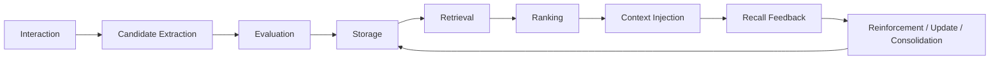

# 长期记忆系统设计

## 1. 文档状态与目标

**Draft，2026-09-18。** 这是目标设计，不是功能说明。当前只有 `session/working_memory.py` 的进程内会话历史；`memory/` 下的文件均为空白占位，尚无持久化 Memory。Owner 已确定 v0.1 先进行本地对话模型试运行；SQLite 支撑的手动记忆闭环保留为后续候选，正式版本范围另行确定。长期目标是 Persistent Character Memory。**LLM 不等于 Memory；Memory 必须独立于模型存在。**

## 2. 目标

选择性保存长期有价值的信息，并从大量记录中检索本轮相关部分。区分事实、经历、偏好和关系事件，记录来源、时间、置信度与重要性；支持更正、冲突处理、遗忘、强化与整合。逐步形成用户画像、Agent 可追溯的自身经历与双方共同历史，使更换模型后仍能保留有依据的连续性。以上均为目标，非当前能力。

## 3. 非目标

不假装 Agent 有真实意识，不编造经历，不永久保存每句聊天，不每轮发送全部历史，不让人格随聊天无限漂移。不绑定单个模型供应商，不让模型任意修改底层数据库，也不把 Identity、Relationship、State 或任意临时状态塞进 Memory。

## 4. 核心概念边界

| 概念 | 归属与生命周期 | 保存内容 |
| --- | --- | --- |
| Working Memory | `session`；会话或任务期间，允许随退出消失 | 当前已实现最近消息；当前任务、临时变量、Tool Result 属未来扩展 |
| Persistent Memory | `MemoryService`；跨会话与重启 | 经提取、评估后写入的事实、经历、偏好、共同历史；当前未实现 |
| Context | Context Builder 的本轮输出 | 从各来源选出的有限信息，不是存储 |
| Identity | 稳定角色定义 | 核心人格、价值、默认交流方式、定位 |
| Relationship State | Relationship Service | 当前熟悉程度、互动模式、关系阶段、共同历史强度 |
| Current State | State Service | Agent 当前模拟状态 |

Memory 记录“经历了什么、学到什么”；Identity 定义稳定角色，记忆不得任意覆盖它。Relationship Memory 是双方的历史事件，当前关系状态由 Relationship Service 维护。Affective Memory 是过去事件的情感属性，不等于 State Service 的当前模拟状态。**Memory 是长期信息；Context 是本轮给模型的信息**，后者只能取相关子集。

## 5. Memory 类型体系（目标）

| 类型 | 保存内容与示例 | 形成方式 | 典型检索条件 | 当前实现 |
| --- | --- | --- | --- | --- |
| Semantic | 可陈述事实，如用户使用 Python | 明确陈述经核验 | 实体与主题 | 无 |
| Episodic | 一次有意义的事件，如共同完成某项目 | 交互事件提取 | 时间、任务、参与者 | 无 |
| Autobiographical | Agent 有来源的连续经历 | 多次事件整合 | 自身经历、阶段 | 无 |
| Preference | 用户偏好，如回答语言 | 明确表达或重复行为 | 当前选择与主题 | 无 |
| Relationship Event | 重要互动和共同经历 | 事件评估 | 人物、关系主题 | 无 |
| Affective | 过去事件的情感标签 | 对事件谨慎标注 | 情感关联与事件 | 无 |
| Procedural | 可复用做事方法 | 成功流程总结 | 任务类型 | 无 |
| Prospective | 未来待办或承诺 | 明确约定并确认 | 到期、任务 | 无 |
| Meta-memory | 记忆自身的可靠性与关联 | 检索反馈、冲突分析 | 置信度、来源 | 无 |

Working Memory 在认知概念上也属记忆，但软件上放在 Session。第一阶段仅需支持少量明确类型，不能把整张表当作首版交付。

## 6. 生命周期（目标）

Extraction 只产候选；Evaluation 判断价值、可信度与风险；Storage 保存带来源记录；Retrieval 取可能相关项；Ranking 在预算内排序；Context Injection 交由 Context Builder；Feedback 观察召回是否有用；最后更新、强化或整合。M1 先实现手动写入与基础召回，完整反馈循环留待后续。

## 7. Memory Formation

候选来自用户明确要求记住、交互中的稳定事实、值得保留的事件、重复行为形成的偏好。工具结果只有具有长期价值且来源清楚时才可入候选。`MemoryExtractor` 只输出候选，不拥有数据库写权限；模型生成内容不能无条件视为事实。自动形成在手动闭环后实施。

## 8. Memory Evaluation

评估长期价值、重复或临时性、来源可靠度、置信度、重要性、与既有记录的冲突、敏感性，以及是否需用户确认。首版可用明确规则和手动写入；后续才引入模型辅助判断，并保持 Service 对最终写入的控制。

## 9. 数据模型

以下是首阶段建议字段，**尚无已实施 schema**。

| 字段 | 含义 |
| --- | --- |
| `id` | 稳定唯一标识 |
| `type` | 记忆类型 |
| `content` | 规范化内容 |
| `source` | 用户陈述、交互或工具等来源 |
| `created_at` / `updated_at` | 创建与修改时间 |
| `importance` / `confidence` | 重要性与置信度，需约定取值范围 |

未来可加入 `status`、`last_recalled_at`、`recall_count`、`reinforcement_count`、`expires_at`、`supersedes`、`superseded_by`、`entity_ids`、`valence`、`salience`、`embedding`、`metadata`。这些字段不要求首版全部建表；迁移与版本策略要在引入时确定。

## 10. 存储架构

近期候选方案：SQLite 保存结构化字段、内容、时间、来源、状态与评分；先完成 CRUD 和简单相关性筛选。之后由可替换 `EmbeddingProvider` 生成向量，通过 Vector Search 支持语义召回。**SQLite CRUD 不等于完整记忆循环；语义检索是后续闭环目标。** PostgreSQL/pgvector、Qdrant、Milvus 等仅是远期可替换选项，不代表已选型。更换 Store 不应改变 Runtime 与 Service 的高层契约。

## 11. Provider Independence

`MemoryStore` 隔离记录存储，未来 `VectorStore` 隔离向量索引，`EmbeddingProvider` 隔离向量模型；复杂评估可用 `MemoryReasoningProvider` 或抽象 LLM Provider。Memory Service 内不散落 DeepSeek、OpenAI、Claude 或 Gemini 的厂商调用。现有聊天 `ModelProvider.generate` 不能默认当作 Embedding 接口。

## 12. 模块结构

当前 `memory/service.py`、`models/base.py`、`models/semantic.py`、`models/episodic.py`、`store/base.py`、`store/sqlite_store.py`、`retrieval/base.py`、`retrieval/simple_retriever.py`、`extraction/base.py`、`extraction/rule_extractor.py` 均为空文件；相应 `__init__.py` 也没有功能。`consolidation/` 与 `association/` 尚不存在。

首阶段真正需要填充 `models/`（记录结构）、`store/`（接口与 SQLite 实现）、`service.py`（对上层操作）及必要的 `retrieval/`。`extraction/` 用于后续自动候选形成；`consolidation/` 管整合，`association/` 管关联图，等有实际能力时再建，不创建无用途空类。

## 13. 核心接口（目标）

| 接口 | 职责 |
| --- | --- |
| `MemoryStore` | 按 ID 保存、读取、列出、删除；隔离 SQLite |
| `MemoryRetriever` | 从 Store/索引取候选，不直接构造 Prompt |
| `MemoryExtractor` | 从交互生成候选，不直接写库 |
| `MemoryEvaluator` | 去重、价值、来源、风险和冲突评估 |
| `EmbeddingProvider` | 文本向量化，可替换 |
| `MemoryService` | 对 Runtime 暴露受控的保存、召回、列出与删除 |

长期可讨论 `remember(interaction)`、`recall(query, context=None)`、`forget(memory_id)`、`reinforce(memory_id)`、`consolidate()`、`search(query)`。这些是**目标接口草案**，不是当前 Python 方法签名。首阶段可用手动保存、列出、删除和基础召回子集；Runtime 只依赖 MemoryService，不直接依赖 SQLite 或 Vector Store。

## 14. 检索与排序

Storage ≠ Recall：保存过不表示每轮都该想起。目标排序综合语义相似度、新近性、重要性、置信度、关系相关性和任务相关性；纯向量相似度不足以决定是否注入。首阶段可用简单词项或规则评分；任何阶段均需限定返回数量和上下文预算，避免把全部库内容交给模型。

## 15. Context Injection

目标来源为 System Rules、Identity、Current State、Relationship State、相关 Semantic/Episodic Memory、当前对话、任务和 Tool Results。Retriever 只提供候选，Context Builder 负责选择、排序后组合本轮消息。注入时标明记忆来源与置信度，隔离外部内容，避免低置信度记录被当成确定事实或指令。当前 Context Builder 只拼接系统提示、会话历史和输入。

## 16. 更新、冲突与更正

新事实可更正旧事实，但矛盾记录不能无条件并存。未来将旧记录标为 `superseded` 并保留来源及变更轨迹。用户明确更正优先于低置信度推断；推断不得覆盖明确高置信度陈述。删除是用户控制数据的操作，更正是保留可追溯新旧关系的操作，二者不同。首阶段若尚无版本化更正，应明确限制，避免伪装已支持。

## 17. 遗忘、强化与整合（Future）

Decay、Reinforcement、Recall Count、Last Recalled、Archive、去重、Consolidation、Reconsolidation、Conflict Resolution 与 Association Graph 均尚未实现。后续通过状态和事件记录决定衰减与强化，避免简单按次数把错误信息越用越强；归档、删除和过期的语义需分别定义。

## 18. 隐私和控制

用户应可查看、删除指定记录并清空长期记忆；敏感信息不应无条件自动保存。数据库默认本地保存，`.env` 和数据库不进入 Git；日志不得记录 API Key，调试输出不得倾倒全部私人记忆。未来需导出、备份、迁移和删除语义。以上是实施要求，当前尚无长期记忆可操作。

## 19. 第一阶段实现范围（候选 M1）

按依赖顺序：基础模型 → `MemoryStore` 抽象 → SQLite Store → `MemoryService` → 手动保存、列出、删除 → 重启读取与测试 → 简单相关记忆检索 → Context Builder 注入。`/remember <内容>`、`/memories`、`/forget <id>` 是候选 CLI 命令，**现在不可用**。Embedding 和自动提取后续单独推进。项目版本分解见 [roadmap.md](./roadmap.md)，不能以此节视为已批准的下一版本。

## 20. 第一阶段验收标准

保存获得稳定 ID；重启后可读；能列出和删除指定记录，删除在重启后仍生效；相关记录可在受限预算内进入 Context。`/reset` 只清空 Session、不删除长期 Memory；Runtime 不执行 SQL；`.env` 与数据库不进 Git；数据库错误明确；同一 Store 接口可换内存实现。每项需实际测试，不能仅以文件存在验收。

## 21. 长期演进（Memory 能力阶段）

| 阶段 | 目标能力 |
| --- | --- |
| M1 | Basic Persistent Memory：手动 CRUD、重启、基础召回 |
| M2 | Memory Quality：提取、评估、去重和更正 |
| M3 | Forgetting and Reinforcement：受控遗忘与强化 |
| M4 | Relationship Memory：关系事件与当前关系状态分离 |
| M5 | Consolidation：多条记录整合 |
| M6 | Autobiographical Memory：可追溯的自身经历 |
| M7 | Association Graph：实体与事件关联 |
| M8 | Affective Memory：过去事件的情感属性 |
| M9 | Prospective Memory：待办与未来约定 |
| M10 | Persistent Character Memory：跨模型的可靠角色连续性 |

M 编号是子系统能力阶段，不是项目 `v0.X` 开发版本或日期承诺。

## 22. 基础规则

| 规则 | 含义 |
| --- | --- |
| Storage ≠ Recall | 存下不等于当轮召回 |
| Memory ≠ Context | 长期库不等于本轮模型输入 |
| Memory ≠ Identity | 经历不能任意改写核心身份 |
| Memory ≠ Truth | 记忆有来源、置信度和更正可能 |
| More Memory ≠ Better Agent | 数量增长不保证相关性与质量 |
| LLM is replaceable; Memory must survive | 更换模型时长期记录仍应可用 |

整体模块边界见 [architecture.md](./architecture.md)。
